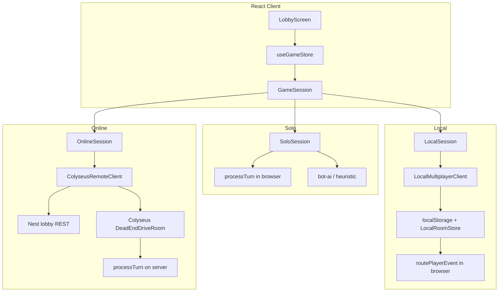

# Play Modes — Solo, Local, and Online

**13 Dead End Drive** supports three distinct ways to play. They share the same board rules, engine, and UI, but differ in **where game state lives**, **who applies moves**, and **how players connect**.

This document is the deep-dive reference for developers and operators. For a quick start, see the root [README.md](../README.md).

---

## Table of contents

1. [Executive comparison](#executive-comparison)
2. [Shared architecture](#shared-architecture)
3. [Mode: Solo](#mode-solo)
4. [Mode: Local](#mode-local)
5. [Mode: Online](#mode-online)
6. [Lobby UX flow](#lobby-ux-flow)
7. [Configuration and dev commands](#configuration-and-dev-commands)
8. [Choosing the right mode](#choosing-the-right-mode)
9. [Troubleshooting](#troubleshooting)
10. [Source map](#source-map)

---

## Executive comparison

| Dimension | **Solo** | **Local** | **Online** |
|-----------|----------|-----------|------------|
| **Tagline** | You vs AI on this device | Host or join on this device | Play over the network |
| **`playMode` value** | `'solo'` | `'local'` | `'online'` |
| **Players** | 1 human + 1–3 bots | 2–4 humans (one seat per browser tab) | 2–4 humans (any device that can reach the server) |
| **Lobby required?** | No — starts game immediately | Yes — room code + waiting room | Yes — room code + waiting room |
| **Who runs the engine?** | Browser (`processTurn`) | Browser (`routePlayerEvent` → engine) | Game server (`processTurn` on Colyseus room) |
| **Authoritative state** | Client `SoloSession` | Shared `LocalRoomStore` + `localStorage` | Nest/Colyseus + Supabase persistence |
| **Network** | Optional HTTP to bot-ai only | None (same-origin `localStorage` sync) | REST lobby + WebSocket (Colyseus) |
| **Bots** | Yes (Python service or TS fallback) | No | No (v1); server bot coordinator planned for online bot seats |
| **Secret cards / masking** | Full state in browser (you only control human seat) | Per-tab `filterStateForPlayer` | Server `broadcastMaskedState` per socket |
| **Typical dev command** | `npm run dev` | `npm run dev` | `npm run dev:all` |



---

## Shared architecture

### `PlayMode` and store

The canonical type is `PlayMode = 'solo' | 'local' | 'online'` (`src/client/store/applyPlayerAction.ts`).  
`useGameStore` holds:

| Field | Purpose |
|-------|---------|
| `playMode` | Active mode |
| `gameState` | Current `GameState` snapshot in the UI |
| `localPlayerId` | Seat this browser controls |
| `localPlayerName` | Display name for that seat |
| `gameSession` | `GameSession` implementation for action dispatch |
| `mpClient` | `LocalMultiplayerClient` when `playMode === 'local'` |
| `onlineClient` | `ColyseusRemoteClient` when `playMode === 'online'` |
| `roomCode` | 6-character lobby code (local + online only) |
| `botPlayerIds` | Bot seat IDs (solo only) |

### `GameSession` — one ingress, three backends

RFC 006 introduced `GameSession` so the HUD always calls `dispatchGameEvent` → `session.submitAction(event)`:

| Session | File | `submitAction` behavior |
|---------|------|-------------------------|
| `SoloSession` | `src/client/session/SoloSession.ts` | Runs `processTurn(state, event)` locally; returns new state |
| `LocalSession` | `src/client/session/LocalSession.ts` | Delegates to `LocalMultiplayerClient.submitAction` |
| `OnlineSession` | `src/client/session/OnlineSession.ts` | Sends event to server; returns `null` (state arrives via `STATE_SYNC`) |

Factory: `createGameSession(playMode, gameState, mpClient, onlineClient)` in `src/client/session/createGameSession.ts`.

### Turn eligibility

`isHumanTurn(gameState, localPlayerId, playMode)` is true when `gameState.activePlayerId === localPlayerId`.

- **Solo:** You never control bot seats; `BotOrchestrator` drives bot turns.
- **Local / Online:** Each tab only sends actions for its own `localPlayerId` when it is their turn.

### UI overlays

`useUiStore.activeOverlay`: `'lobby' | 'game' | 'game-over'`.

- Lobby modes stay on `'lobby'` until the host starts the match (`startMultiplayerGame`) or solo skips lobby entirely.
- When `gameState.phase` becomes `IN_PROGRESS`, `syncServerState` sets overlay to `'game'`.

### Engine pipeline (when moves are applied)

For **solo** and **local**, the pure engine pipeline still applies inside the client:

1. Guards (turn, phase, dice, etc.)
2. `moveCharacter` / `playCard` / etc. via `turnOrchestrator` or `routePlayerEvent`
3. `evaluateTraps` → `evaluateWin`

**Online** runs the same logic on the server inside `DeadEndDriveRoom.handlePlayerAction`; the client never calls `processTurn` for human moves.

### LOBBY phase stub state

Before `initializeGame`, multiplayer lobbies use `phase: 'LOBBY'` with empty `characters`, `board`, and `traps` placeholders. Chair-repair helpers (`repairGridChairSpawns`) **no-op** on `LOBBY` so hosting does not crash. Full grid and pawns appear only after **Start match**.

---

## Mode: Solo

### What it is

Single-player vs 1–3 AI opponents on one browser. No room code, no second human, no Colyseus. Ideal for learning rules, testing UI, or offline play.

### User flow

1. Lobby → **Solo**
2. Enter name, pick **AI opponents** (1–3) and **difficulty** (`EASY` | `NORMAL` | `HARD`)
3. **Start solo game** → immediately enters the 3D/2D board (`activeOverlay: 'game'`)

### What happens in code

`useGameStore.startSoloVsBots`:

1. Clears any stale `ded-room-state-*` keys from `localStorage` (avoids colliding with local multiplayer rooms).
2. Creates `player-human-{uuid}` and `player-bot-01` … `player-bot-03` IDs (`botRegistry.ts`).
3. Calls `initializeGame(SOLO_GAME_ID, playerIds, names)` → full `IN_PROGRESS` state (board, traps, hands, detective track).
4. Sets `playMode: 'solo'`, `gameSession: new SoloSession(gs)`, `botPlayerIds`, `botDifficulty`.
5. Triggers `botOrchestrator.scheduleTurnCheck` if a bot is active.

### Authority and bots

- **Human moves:** `SoloSession.submitAction` → `processTurn` in `@ded/engine`.
- **Bot moves:** `BotOrchestrator` when `activePlayerId` matches a `player-bot-*` id:
  1. `enumerateLegalActions` in TypeScript
  2. POST masked state + legal list to `VITE_BOT_SERVICE_URL` (default `/bot-api` → Python `services/bot-ai`)
  3. On timeout/failure → `pickHeuristicAction` in `heuristicFallback.ts`
  4. `submitBotAction` → same `processTurn` path as the human

Bot service contract: `POST /v1/decide` with `BotDecisionRequest` / `BotDecisionResponse` (`src/types/bot-api.ts`).

### State visibility

The human sees the full `GameState` in memory (no asymmetric masking in solo). Bots “know” only what you send to the bot service (masked copy via `filterStateForPlayer` for the bot seat).

### Limits

| Topic | Detail |
|-------|--------|
| Player count | 2–4 total (you + bots) |
| Persistence | Match lives in memory until refresh; no auto-save |
| Multiplayer | Not compatible with room codes while a solo game is active in the same tab |

---

## Mode: Local

### What it is

**Browser-local multiplayer**: multiple human players on the **same machine and same origin** (e.g. `http://localhost:5173`), typically **one player per browser tab or window**. State is synchronized through **`localStorage`** and the `storage` event—not over Wi‑Fi or the public internet.

> **Important:** Local mode is **not** “friends on their phones join from home.” For that, use **Online** mode with the game server running and reachable.

### User flow

1. Lobby → **Local** → **Create room**
2. Enter name → **Host local room**
3. **Waiting room** shows a **6-character room code** (click to copy)
4. Other players: new tab → **Local** → **Join with code** → enter code + name → **Join**
5. Host clicks **Start match** when 2–4 players are present
6. Each player acts only on **their** turn in **their** tab

### What happens in code

**Host — `hostRoom(playerName)`:**

1. `new LocalMultiplayerClient(playerId, playerName)`
2. Store sets `mpClient`, `playMode: 'local'` **before** `createRoom()` (so sync callbacks see the client).
3. `createRoom()`:
   - Generates `roomId` (UUID) and `roomCode` (6 chars, `Math.random().toString(36)`).
   - Builds `GameState` with `phase: 'LOBBY'`, host as sole `turnOrder` entry.
   - Saves to in-memory `LocalRoomStore` and `localStorage` key `ded-room-state-{roomId}`.
   - `emit()` → `onStateSync` → `syncServerState` + `roomCode` in store.

**Join — `joinRoom(playerName, code)`:**

1. Scans `localStorage` for `ded-room-state-*` to hydrate `LocalRoomStore` (cross-tab discovery).
2. `getRoomByCode(code)` or throws `ROOM_NOT_FOUND`.
3. Appends joiner to `turnOrder` and `players`; persists; `emit()` to all listeners in that tab.

**Start — `startMultiplayerGame()` (local branch):**

1. `mpClient.startGame(playerIds, displayNames)` → `initializeGame(roomId, …)` → `phase: 'IN_PROGRESS'`.
2. `syncServerState` → overlay `'game'`.

**During play — `LocalSession`:**

- Human action → `commitPlayerAction` → `LocalMultiplayerClient.submitAction` → `routePlayerEvent` (idempotency per room) → persist → `emit()`.

### Cross-tab sync

```text
Tab A (host)                    Tab B (joiner)
    |                                |
    |  persistRoomState()            |
    |  localStorage['ded-room-...']  |
    | ------------------------------>|
    |         'storage' event        |
    |                                | mpClient.syncFromStorage()
    |                                | emit() → UI update
```

Registered in `useGameStore.ts`:

```ts
window.addEventListener('storage', () => {
  const s = useGameStore.getState();
  if (s.mpClient) s.mpClient.syncFromStorage();
});
```

Only **other** tabs receive `storage` events; the writing tab updates via `emit()` directly.

### Masking

`filterStateForPlayer` strips other players’ hands, rooting cards, and (until reveal) secrets—same rules as server broadcast, applied client-side on each `emit()`.

### Limits

| Topic | Detail |
|-------|--------|
| Max players | 4 |
| Network | Same browser profile / origin only |
| `localhost` | Other devices cannot join your room code unless they share your machine’s browser storage (they cannot) |
| Server | Not required |
| Bots | None in local mode |
| Refresh | State recovers from `localStorage` if keys remain; stale chair layout revisions may invalidate old saves |

---

## Mode: Online

### What it is

**Server-authoritative** multiplayer: NestJS REST for lobby lifecycle, Colyseus WebSocket for gameplay, Supabase (when configured) for room persistence and reconnect. Any client that can reach `VITE_COLYSEUS_URL` and `VITE_LOBBY_API_URL` can join with a room code.

Governed by [RFC 005 — Colyseus + Nest transport](./rfc/rfc_005_colyseus_nest_transport.md).

### User flow

1. Ensure `VITE_ONLINE_MULTIPLAYER=true` in `.env` (see `.env.example`).
2. Run stack: `npm run dev:all` (client `:5173`, game-server `:2567`, bot-ai `:8000`).
3. Lobby → **Online** → **Create room** or **Join with code**
4. Waiting room → host **Start match**
5. Play; moves go to server; UI updates from `STATE_SYNC` messages

If online is disabled in env, the **Online** card is hidden in `LobbyScreen.tsx`.

### What happens in code

**`ColyseusRemoteClient`:**

| Step | API | Result |
|------|-----|--------|
| Create | `POST /lobby-api/lobby/create` `{ displayName }` | `roomId`, `roomCode`, `playerId`, initial `gameState` |
| Join | `POST /lobby-api/lobby/join` `{ roomCode, displayName }` | Same shape for joiner |
| Connect | `colyseus.joinOrCreate('dead_end_drive', { roomCode, playerId, displayName })` | WebSocket to room |
| Start | `POST /lobby-api/lobby/start` `{ roomId, playerId, playerIds, displayNames }` | Full `IN_PROGRESS` state |
| Play | `room.send('playerAction', event)` | Server processes; clients receive `STATE_SYNC` |

Vite proxies `/lobby-api` → `http://localhost:2567` (`vite.config.ts`).  
WebSocket URL: `VITE_COLYSEUS_URL` (default `ws://localhost:2567`).

**`OnlineSession`:**

- `submitAction` only sends to Colyseus; **never** mutates local state with `processTurn`.
- `applyServerState` updates UI when `STATE_SYNC` arrives.

**Server — `DeadEndDriveRoom` (`src/server/dead-end-drive.room.ts`):**

- Loads/creates room from `RoomPersistenceService` (Supabase-backed when env keys set).
- Validates `playerAction` (player id, rate limit, idempotency).
- Runs engine; `broadcastMaskedState` to each connected client.
- Reconnect: re-join with same `playerId` + `roomCode` (RFC 005).

### Authority diagram

```text
  Browser A                    Game Server                 Browser B
      |                             |                          |
      | POST /lobby/create          |                          |
      | joinOrCreate WS             |                          |
      |                             | POST /lobby/join         |
      |                             | joinOrCreate WS          |
      | playerAction -------------->| processTurn              |
      |                             | broadcast STATE_SYNC ---->|
      |<----------- STATE_SYNC -----|                          |
```

### Guest auth (v1)

No Supabase Auth JWT yet. Server issues `playerId` at create/join; Colyseus `client.auth` binds socket to that id. Events must carry matching `event.playerId`.

### Bots (online)

- **Solo:** client → `/bot-api`.
- **Online bot seats (future / partial):** Nest `BotTurnCoordinator` → `BOT_AI_URL` per RFC 005—not exposed in the lobby UI for human-only rooms in v1.

### Limits

| Topic | Detail |
|-------|--------|
| Max players | 4 |
| Requires | `game-server` running; Supabase optional for persistence but recommended for production |
| CORS | `CORS_ORIGINS` must include client origin (`apps/game-server` env) |
| Client engine | Must not trust local `processTurn` results for online play |

---

## Lobby UX flow

`LobbyScreen.tsx` is mode-first:

```text
┌─────────────────────────────────────┐
│  How do you want to play?           │
│  [ Solo ] [ Local ] [ Online* ]     │
├─────────────────────────────────────┤
│  Your name                          │
├─────────────────────────────────────┤
│  Solo: opponents + difficulty       │
│  Local/Online: Create | Join code   │
└─────────────────────────────────────┘
         * Online if VITE_ONLINE_MULTIPLAYER=true

After host/join success:
┌─────────────────────────────────────┐
│  Waiting room                       │
│  ROOM CODE: XXXXXX (copy)           │
│  Player list (HOST badge)           │
│  [ Start match ]  (host only)       │
│  [ Leave lobby ]                    │
└─────────────────────────────────────┘
```

`isInRoom = !!roomCode` toggles setup vs waiting-room layouts.

---

## Configuration and dev commands

### Client (`.env` / Vite)

| Variable | Default | Used by |
|----------|---------|---------|
| `VITE_ONLINE_MULTIPLAYER` | `true` in example | Shows Online mode in lobby |
| `VITE_COLYSEUS_URL` | `ws://localhost:2567` | Online WebSocket |
| `VITE_LOBBY_API_URL` | `/lobby-api` (proxied) | Online REST |
| `VITE_BOT_SERVICE_URL` | `/bot-api` (proxied) | Solo bots |

### Game server (`apps/game-server`)

| Variable | Purpose |
|----------|---------|
| `PORT` | HTTP + Colyseus (2567) |
| `SUPABASE_URL` / `SUPABASE_SERVICE_ROLE_KEY` | Room persistence |
| `CORS_ORIGINS` | Browser origins allowed |
| `BOT_AI_URL` | Server-side bot coordinator |
| `AUTH_REQUIRED` | `false` in v1 (JWT planned) |

### Commands

| Command | Modes served |
|---------|----------------|
| `npm run dev` | Solo + Local (client only) |
| `npm run dev:all` | Solo + Local + Online (+ bot-ai) |
| `npm run dev:server` | Online server only |
| `npm run dev:bot-ai` | Solo bot decisions |

---

## Choosing the right mode

| Goal | Use |
|------|-----|
| Practice vs AI, no setup | **Solo** |
| Two–four people around one computer (separate tabs) | **Local** |
| Friends on different devices or networks | **Online** |
| Production / ranked / persistence | **Online** + Supabase |

```text
Same laptop, two tabs     → Local
Phone + laptop at home    → Online (deploy server, use LAN IP or hosting)
Solo practice             → Solo
```

---

## Troubleshooting

### Local: “Host local room” does nothing / no room code

- Ensure name field has text (React state must update—Safari autofill may not enable the button until you type).
- After fix for LOBBY + `repairGridChairSpawns`: hosting must not throw; refresh and retry.
- Room code appears only **after** successful host, in the waiting room—not on the setup panel.

### Local: Friend cannot join with code from another device

- Expected. Local uses `localStorage` on one origin. Use **Online** instead.

### Online: “Could not create online room”

- Run `npm run dev:all` or start `game-server` on port 2567.
- Check `VITE_ONLINE_MULTIPLAYER=true`.
- Verify `/lobby-api/health` or game-server logs.

### Online: Connected but state never updates

- Confirm WebSocket to `VITE_COLYSEUS_URL` is not blocked.
- Check browser console for `ERROR` messages from Colyseus.

### Solo: Bots never move

- **During your turn** (Mansion Control shows your name, you have dice/pips to spend): bots do **not** move pawns—that is expected. Finish your move; when `activePlayerId` is `player-bot-*`, `BotOrchestrator` auto-plays.
- **Turn order strip** at the top of the HUD shows who is **playing** and **up next** (clockwise `turnOrder`). This is separate from the twelve red **pawn** dining chairs on the board.
- Start `bot-ai` (`npm run dev:bot-ai` or `docker compose up bot-ai`) for Python decisions; without it, heuristic fallback still runs.
- Check the estate event log for `Bot … is playing…`, bot action lines, or `Bot action rejected` / `turn stalled` errors.

### Join errors (local)

| Symptom | Engine code |
|---------|-------------|
| Invalid code | `ROOM_NOT_FOUND` |
| Game already started | `GAME_ALREADY_STARTED` |
| Fourth player | `ROOM_FULL` |

---

## Source map

| Concern | Primary files |
|---------|----------------|
| Lobby UI | `src/client/components/LobbyScreen.tsx` |
| Store / mode switching | `src/client/store/useGameStore.ts` |
| Play mode type | `src/client/store/applyPlayerAction.ts` |
| Sessions | `src/client/session/SoloSession.ts`, `LocalSession.ts`, `OnlineSession.ts`, `createGameSession.ts` |
| Local transport | `src/client/multiplayer/localMultiplayerClient.ts`, `packages/network/src/localRoomStore.ts` |
| Online transport | `src/client/multiplayer/colyseusRemoteClient.ts`, `src/server/dead-end-drive.room.ts` |
| Lobby REST | `apps/game-server/src/lobby.controller.ts`, `lobby.service.ts` |
| Bots (solo) | `src/client/bots/BotOrchestrator.ts`, `services/bot-ai/` |
| Player turn HUD strip | `src/client/components/PlayerTurnStrip.tsx`, `src/client/lib/playerSeatLayout.ts` |
| Engine | `packages/engine/src/turnOrchestrator.ts`, `gameInitializer.ts` |
| RFC | `.context/rfc/rfc_005_colyseus_nest_transport.md`, `rfc_006_clean_architecture.md` |

---

*Last updated: 2026-06-01 — aligns with Phase 5 hybrid transport (client solo/local, server online).*
