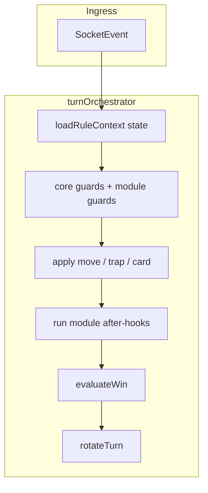

# RFC 007 — Advanced Rule Engine (Proposal)

**Status:** PROPOSED — not implemented  
**Author:** Product / engine team  
**Depends on:** RFC 006 (clean architecture), `turnOrchestrator` pipeline  
**Player guide:** [`docs/HOW_TO_PLAY.md`](../../docs/HOW_TO_PLAY.md)

---

## Problem

Today the engine encodes a **single ruleset** (1993 Milton Bradley, `GRID_21X15`) directly in modules such as `moveCharacter.ts`, `movementPlan.ts`, `trapEvaluator.ts`, and `legalActions.ts`. That is correct for MVP but makes it hard to:

- Turn on **optional** rules (secret passages, alternate win tweaks) without `if` spaghetti  
- Run **house rules** or playtest variants in the lobby  
- Validate bots and clients against **multiple** rule profiles  
- Document “standard vs advanced” for players in one place ([`docs/HOW_TO_PLAY.md`](../../docs/HOW_TO_PLAY.md))

---

## Goals

1. **Default unchanged** — `STANDARD` profile matches current behavior and all existing tests.  
2. **Composable modules** — each optional rule is a named module with guards + hooks.  
3. **Single pipeline** — `processTurn` order stays: guards → move → traps → win → rotate.  
4. **Lobby-selectable** — host picks `ruleProfile` when creating a room; stored on `GameState`.  
5. **Bot-safe** — `enumerateLegalActions` respects active profile so AI does not cheat.

---

## Non-goals (v1 advanced)

- Full user scripting / custom rule DSL  
- *1313 Dead End Drive* complete port in one release  
- Rewriting history — RFCs 001–006 remain invariants for standard play

---

## Proposed model

### `RuleProfile` on `GameState`

```typescript
export const RULE_PROFILES = ['STANDARD', 'ADVANCED'] as const;
export type RuleProfile = (typeof RULE_PROFILES)[number];

// GameState extension (future)
readonly ruleProfile: RuleProfile;
readonly enabledModules: readonly RuleModuleId[]; // when ADVANCED
```

- **`STANDARD`** — current engine only; `enabledModules` ignored.  
- **`ADVANCED`** — `enabledModules` lists toggles (see table below).

### Rule modules (plug-in units)

Each module exports:

| Export | Role |
|--------|------|
| `id` | e.g. `'SECRET_PASSAGES'` |
| `displayName` | Lobby checkbox label |
| `guardMove?(state, event)` | Extra `EngineError` checks before move |
| `guardMovementPlan?(state, plan)` | e.g. chair phase already centralised |
| `afterMove?(state)` | Teleport, extra draws, etc. |
| `extendLegalActions?(state, playerId)` | Bot + UI legality |
| `extendPathfinding?(ctx)` | Reachable cells |

Modules **must not** import each other; orchestrator calls them in registration order.

### Candidate modules (priority order)

| Module ID | Player-facing rule | Engine touchpoints |
|-----------|-------------------|-------------------|
| `SECRET_PASSAGES` | 5 teleport nodes on board | `pathfinding`, `moveCharacter`, `boardDefinition` |
| `STRICT_CHAIR_PHASE` | (already on) Combined blocked until table clear | `chairPhase.ts`, `movementPlan` — **already in STANDARD** |
| `DETECTIVE_MASS_ELIMINATION` | Document + tune detective step 10 behavior | `advanceDetective`, `winCondition` |
| `PORTRAIT_ON_ANY_DOUBLES` | Already standard — module no-op | — |
| `EXTENDED_TRAP_DECK` | Alternate GDD mix from `data/gdd_trap_deck.json` | `buildDeck()` variant |
| `TWO_PLAYER_REVEAL` | Endgame secret reveal | already in `winCondition` |

RFC recommends shipping **SECRET_PASSAGES** first as proof-of-module, everything else stays STANDARD until toggled.

---

## Architecture sketch



New package (optional): `packages/rules/` or `packages/engine/src/rules/`

```
rules/
  registry.ts          # registerModule(), getModulesFor(profile)
  standard.ts          # empty registry — baseline
  modules/
    secretPassages.ts
    extendedDeck.ts
  RuleContext.ts       # { profile, modules, state }
```

`turnOrchestrator` receives `RuleContext` from `buildRuleContext(state)` once per `processTurn` call.

---

## Client and lobby

| UI | Behavior |
|----|----------|
| Lobby “Rules” section | Radio: **Standard (1993)** / **Advanced** |
| Advanced expand | Checkboxes per `RuleModuleId` with one-line description from module metadata |
| `HOW_TO_PLAY.md` | Link “Playing with advanced rules” appendix when modules ship |
| Dice / console | No change for STANDARD |

Store `ruleProfile` + `enabledModules` in:

- `initializeGame()` args  
- Colyseus room metadata  
- Local room `localStorage` record  

---

## Testing strategy

1. **Standard regression** — entire Vitest suite runs with `ruleProfile: 'STANDARD'` (default).  
2. **Module specs** — one spec file per module; only run when module enabled in fixture.  
3. **Matrix job (CI)** — optional job `STANDARD + SECRET_PASSAGES` on PR when `packages/rules/` changes.  
4. **Bot contract** — `enumerateLegalActions` golden files per profile in `data/fixtures/`.

---

## Migration phases

| Phase | Deliverable |
|-------|-------------|
| **0** (done) | [`docs/HOW_TO_PLAY.md`](../../docs/HOW_TO_PLAY.md) + chair/combined rules in STANDARD engine |
| **1** | `RuleProfile` type on `GameState`, `buildRuleContext`, registry stub (no-op modules) |
| **2** | Lobby UI + persistence; default `STANDARD` |
| **3** | First module: `SECRET_PASSAGES` + tests + HOW_TO_PLAY appendix |
| **4** | Bot `legalActions` delegates to `extendLegalActions` chain |
| **5** | Additional modules per product priority |

---

## Open questions

1. Should **Solo** allow advanced rules vs bots, or standard-only until bot-ai trained per profile?  
2. Are secret passages in `data/gdd_board_nodes.json` authoritative for cell pairs?  
3. Does advanced profile require server authority only (online), or also client-local solo?

---

## References

- [board_rules_13_ded.md](../board_rules_13_ded.md) — canonical STANDARD mapping  
- [gdd_technical_blueprint.md](../gdd_technical_blueprint.md) — GDD vs engine matrix  
- [HOW_TO_PLAY.md](../../docs/HOW_TO_PLAY.md) — player-facing rules  
