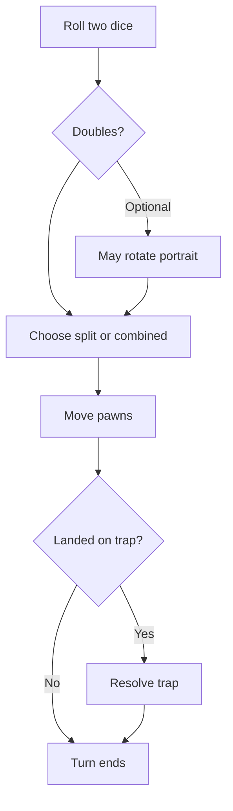

# How to Play — 13 Dead End Drive

A clear guide to the mansion murder-mystery board game as implemented in this app.  
Rules follow the **1993 Milton Bradley** edition ([Geeky Hobbies reference](https://www.geekyhobbies.com/13-dead-end-drive-board-game-review-and-rules/)).

---

## What you are trying to do

You are a player rooting for certain **guests** (characters) in Aunt Agatha’s will. You do **not** own pawns on the board — on your turn you may move **any** living guest. You win if your secret rooting pays off when:

1. The guest shown in the **fireplace portrait** (the **featured heir**) escapes through the **front door** alive **and** you hold that same guest’s **rooting card** — both must match (see [Heir escape win](#win-1--heir-escape)), or  
2. You are the **only player** who still has a living rooted guest, or  
3. The **detective** reaches the front door and you hold the rooting card for whoever is on the portrait (not Aunt Agatha).

Everyone else is trying to do the same.

---

## Before you start (setup)

| Item | What happens |
|------|----------------|
| **Board** | Mansion grid with rooms, furniture, five trap spaces (skull markers), and a detective track (10 steps to the door). |
| **12 guests** | Placed on **12 red dining chairs** around the central table (one guest per chair). |
| **Rooting cards** | Dealt face-down. You learn which guests you are cheering for. **Never show your cards to others** during play. |
| **Portrait** | Starts on **Aunt Agatha**. It will later show a guest — that guest is the current **featured heir**. |
| **Trap deck** | 29 cards shuffled (detective cards, wild cards, and trap cards). |
| **Detective** | Marker starts at step 0; step 10 is the front door. |

### Rooting cards by player count

| Players | Cards each player receives |
|---------|----------------------------|
| **2** | 4 visible rooting guests + **2 secret** guests |
| **3** | 4 rooting guests each |
| **4** | 3 rooting guests each |

In a **2-player** game, your two secret guests are revealed to everyone only when the game ends.

---

## Turn overview (every player)

Play moves **clockwise** around the table. The **active player** does the following:

1. **Roll** two six-sided dice.  
2. **Doubles only (optional):** You *may* rotate the fireplace portrait once before moving (see below). You do **not** roll again.  
3. **Choose how to use the dice** (every turn, including doubles):  
   - **Split** — move one guest exactly **die 1** spaces, then a **different** guest exactly **die 2** spaces.  
   - **Combined** — move **one** guest exactly **die 1 + die 2** spaces; then your turn ends.  
4. **Move** by selecting a guest and a path on the board (orthogonal steps only; you must use the full die value).  
5. If a guest **lands on a trap space** this turn, resolve the trap (see below).  
6. Turn passes to the next player.

**Important:** Any active player may move **any** alive guest, not only the guests on their rooting cards.

---

## Opening phase — clear the dining table

At the start, every guest sits on a **red chair**. Special rules apply until **all** guests have left the chairs:

| Rule | Meaning |
|------|---------|
| **Who can move** | You may only move guests that are **still on a chair** (moving them **off** the chair). |
| **No combined dice yet** | You must use **split** dice only — one guest off the table with die 1, then another guest with die 2. You **cannot** combine die 1 + die 2 on a single guest until **every** guest has left the chairs. |
| **No trap landings** | While any guest remains on a chair, no one may end a move on a **trap space**. |
| **Chairs are blocked** | Guests cannot move **through** or **onto** chair cells after they have left the table. |

Once all twelve guests are off the red chairs, normal movement and combined dice apply.

---

## Movement rules (always)

- Move **orthogonally** (up, down, left, right) — no diagonals.  
- You must use the **exact** number of spaces rolled (no partial moves).  
- You cannot move **through** or **onto** another guest.  
- You cannot move through **furniture obstacles** (piano, tables, etc.).  
- The **front door** is cell **K1** on the board map.

### Split vs combined (after the table is clear)

| Choice | Example roll 4 + 3 | Result |
|--------|-------------------|--------|
| **Split** | Move guest A exactly **4** spaces, then guest B exactly **3** spaces (B must be different from A). | Two moves |
| **Combined** | Move one guest exactly **7** spaces. | One move, turn ends |

You cannot split a single die (e.g. use 4 as 2+2).

---

## Doubles (optional portrait change)

If both dice show the **same number** (doubles):

- You **may** rotate the portrait **once** before your first move (optional — you can skip this).  
- The top card of the hidden portrait stack is revealed; that guest becomes the new **featured heir**.  
- You still choose **split** or **combined** and move normally. Doubles do **not** grant an extra roll or a free card draw.

If the featured guest **dies**, the portrait advances to the next guest in the stack.

---

## Trap spaces (skull markers)

When a guest **lands on a trap space** during a move, the active player must resolve it:

### Your options (in order of decision)

1. **Play a trap card** from your hand that matches that trap (or a **wild** card) — if you do, the trap **fires** and the guest on that space is eliminated.  
2. **Draw** one card from the trap deck, then follow what you drew.  
3. **Decline** — the guest survives; the trap stays armed for a future landing.

You only draw when someone **lands** on a trap this turn (there are no separate “draw squares” on this board).

### After you draw a card

| Card type | What happens |
|-----------|----------------|
| **Detective** | Reveal it, move the detective **one step**, discard it, then **draw again** until you get a non-detective card. Detective cards are **never** kept in hand. |
| **Trap or wild** | You may **keep** it in hand and stop, **or** play it immediately if it matches the trap you landed on. |
| **Wrong trap** | If it does not match, you **keep** it in hand. |

### When a trap fires

- The guest on that space is **eliminated**.  
- If they were the **featured heir**, the portrait updates.  
- If they were on someone’s rooting card, that player’s interest in them is **revealed** (one card at a time — not your full hand).

---

## Detective track

- The detective advances when **detective cards** are drawn from the trap deck.  
- There are **10 steps**; at step **10** the detective reaches the **front door**.  
- When that happens, the player who holds the rooting card for the **current portrait guest** wins (not Aunt Agatha).  
- Reaching the door can also trigger a **mass elimination** of guests — check the in-game event log and rules summary when it happens.

---

## Rooting cards and secrets

- Only **you** see your full hand (including secret guests in a 2-player game).  
- When a guest **dies**, players learn **who was rooting for that guest** — but not your other cards.  
- Root for guests who match the portrait, can reach the door, or are the last ones standing.

---

## Winning — quick reference

| # | How you win |
|---|-------------|
| 1 | **[Heir escape](#win-1--heir-escape)** — portrait guest reaches **K1** alive; you hold **that** guest’s rooting card. |
| 2 | You are the **only player** with at least one living rooted guest left. |
| 3 | The **detective** hits step 10 — you hold the rooting card for the **current portrait guest** (not Aunt Agatha). |

### Win 1 — Heir escape

This win needs **two things at once**:

| Requirement | What it means |
|-------------|----------------|
| **Portrait match** | The guest in the **fireplace portrait** (featured heir) must be the one who steps onto the **front door (K1)**. |
| **Your rooting card** | You must hold that **same** guest on your rooting cards (visible or secret). |

**Does not win:** A guest you root for reaches the door, but a *different* guest is on the portrait.  
**Does not win:** The portrait guest reaches the door, but no player holds their rooting card.  
**Does not win:** Aunt Agatha is on the portrait (she is not a board guest).

Watch **Current Active Heir** (top-left HUD) — that face must escape, and you must have their card.

---

## Playing in this app

| Mode | How to use |
|------|------------|
| **Solo** | Lobby → Solo → pick bots and difficulty → play vs AI. Bots only move on **their** turn; you move on yours. |
| **Local** | Same computer, one browser tab per player; share the room code. |
| **Online** | Host/join over the network (requires game server). |

### HUD tips

- **Turn order strip** (top) — who is playing now and who is up next.  
- **Current Active Heir** (top left) — portrait guest for win condition 1 and 3.  
- **Mansion Control** (right) — dice, movement plan, your rooting guests, event log.  
- **Your Hand** (bottom) — trap cards you can play when landing on traps.  
- **Detective** / **Deck** (bottom right) — track progress and deck size.

The **red chairs on the board** are **guest starting positions**, not player seats.

---

## What this release does *not* include

These are **not** in the current digital ruleset (see [Advanced rules](#advanced-rules-future) for plans):

- Secret passage teleports on the board  
- *1313 Dead End Drive* (2002 sequel) rules  
- House-rule variants as a menu toggle  

---

## Advanced rules (future)

The game today runs one **standard** rules engine (1993 rules above). A future **advanced rule engine** would let hosts enable extra modules (e.g. secret passages, variant decks) without changing the default experience. See [`.context/rfc/rfc_007_advanced_rule_engine.md`](../.context/rfc/rfc_007_advanced_rule_engine.md) for the technical plan.

---

## Need more detail?

| Document | Audience |
|----------|----------|
| [`.context/board_rules_13_ded.md`](../.context/board_rules_13_ded.md) | Developers — exact engine mapping |
| [`.context/play_modes.md`](../.context/play_modes.md) | Solo / local / online setup |
| [README.md](../README.md) | Install and run the app |

---

*Last updated: 2026-06-01 — matches engine chair-phase + combined-move restrictions.*
